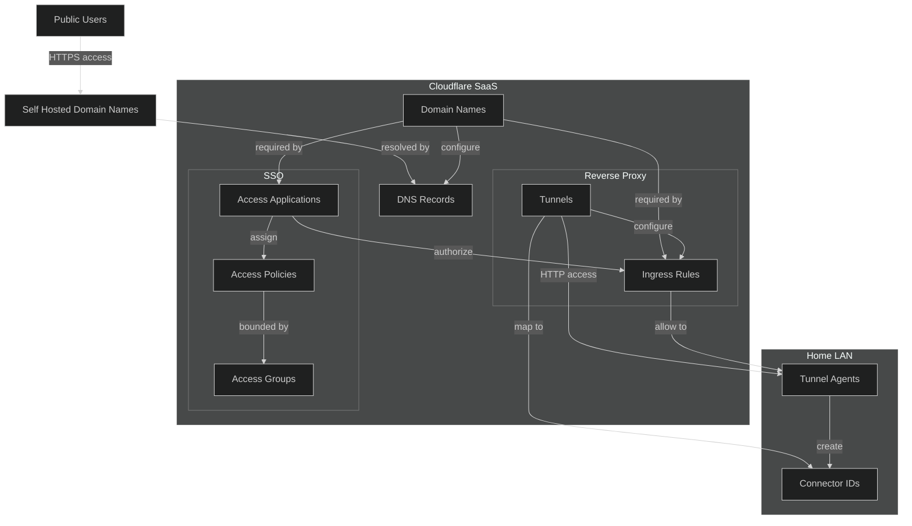
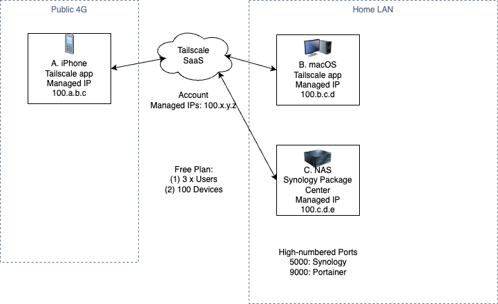

# playnology

Starter project for your Synology NAS.

---
# 1. Introduction
## 1.1. Purpose

This document describes the Synology NAS automation and manual services that is provided for DevSecOps engineers.

## 1.2. Audience

The audience for this document includes:

* Mobile User who will use their iPhone to access the container applications hosted on Synology NAS.

* DevSecOps Engineer who will install, configure and update the Synology NAS services to ensure continuous uptime and backup redundancy.

## 1.3. Terms and Acronyms

| Term |      Definition      |
|:----:|:--------------------:|
| DSM  | Disk Station Manager |

---
# 2. System Overview
## 2.1. Benefits and Values

1. We recommend Cloudflare [security](#23-security) over both Tailscale and Zerotier VPNs to access your Synology NAS.
  * write infrastructure as code using a Terraform [provider][v01].
  * manage infrastructure as code using a GitLab CI/CD [pipeline][v02].

[v01]: https://registry.terraform.io/providers/cloudflare/cloudflare/latest/docs
[v02]: https://gitlab.com/dso-coe/manage-cloudflare

## 2.2. Limitations

1. DSM 7.2 has stopped support for Docker.

## 2.3. Security

### Cloudflare
  * Cloudflare has a generous free tier (no credit card) compared to Tailscale.
    * has both a built-in SSO and a reverse proxy tunnel.
    * does not require an agent to be installed on each device.
    * requires a custom domain name.
  * High level overview of Cloudflare resources




## 2.4. Deprecated

* ZeroTier was [deprecated](./doc/decisions/deprecated.md) in favour of Tailscale.
* Tailscale was deprecated in favour of Cloudflare.
  * Tailscale is supported by Synology Package Center, hence it does not require running a custom Docker container.
  * Tailscale has a lower limit on users and devices than ZeroTier.
* Tailscale overview

  

---
# 3. User Personas
## 3.1 RACI Matrix

|           Category           |                           Activity                            | Mobile User | DSO Engineer |
|:----------------------------:|:-------------------------------------------------------------:|:-----------:|:------------:|
| Installation & Configuration |                   [Installing Ansible][i01]                   |             |     R,A      |
| Installation & Configuration | [Setting up a `cloudflared` agent on your Synology NAS][i04]  |             |     R,A      |
| Installation & Configuration | [Protecting the route from Public Domain to your server][i05] |             |     R,A      |
|          Execution           |            [Creating a basic inventory file][e01]             |             |     R,A      |
|          Execution           |       [Running your first Ad-Hoc Ansible command][e02]        |             |     R,A      |
|          Execution           |              [Your first Ansible playbook][e03]               |             |     R,A      |
|          Execution           |           [Docker-compose Deployment with SSH][e04]           |             |     R,A      |
|          Execution           |     [Docker-compose Deployment with Portainer Stack][e05]     |             |     R,A      |
|          Execution           |  [Docker-compose Deployment with Portainer Containers][e06]   |             |     R,A      |
|          Execution           |  [Adding a new route from Public Domain to your server][e07]  |             |     R,A      |
|           Updating           |                 [Manually updating DSM][m01]                  |             |     R,A      |

[i01]: #51-installing-ansible
[i04]: #54-setting-up-a-cloudflared-agent-on-your-synology-nas
[i05]: #55-protecting-the-route-from-public-domain-to-your-server
[e01]: #61-creating-a-basic-inventory-file
[e02]: #62-running-your-first-ad-hoc-ansible-command
[e03]: #63-your-first-ansible-playbook
[e04]: #64-docker-compose-deployment-with-ssh
[e05]: #65-docker-compose-deployment-with-portainer-stack
[e06]: #66-docker-compose-deployment-with-portainer-containers
[e07]: #67-adding-a-new-route-from-public-domain-to-your-server
[m01]: #91-manually-updating-disk-station-manager-dsm

---
# 4. Requirements
## 4.1. Synology
### 4.1.1. Changing SSH Password

#### Enabling SSH

You can enable SSH service from the `Control Panel`. Go to `Terminal & SNMP` and check the box `Enable SSH service` and click `Apply`.

After enabling SSH service, you will find out that you are unable to login with the admin password on the Synology web interface. We will need to temporarily enable Telnet service to fix this problem.

#### Temporarily Enabling Telnet (Deprecated)
<details><summary>Click here to Temporarily Enabling Telnet (Deprecated).</summary><br>

Under the previous `Terminal & SNMP`, check the box `Enable Telnet service` and click `Apply`. You have to connect to both Telnet and SSH on the LAN because it doesn't work with Quickconnect.

On your iPhone, download the app iTerminal. Open the app and create a Telnet connection specifying your `[PRIVATE_IP]` address on port `23`.

Login using `admin` and same password as your Synology web interface. Type the following command to change the SSH password:

```bash
$ sudo synouser --setpw admin [PASSWORD]
```

If it doesn't work the first time, try again. After changing the password, you should be able to SSH to your Synology.

Return to your Synology `Control Panel`, and disable the Telnet service.

*Warning: Changing the `admin` password using Task Scheduler did not work.*
</details>

### 4.1.2. Connecting via SSH
<details><summary>Click here to Connecting via SSH.</summary><br>

Using the app iTerminal, create an SSH connection specifying your IP address on port 22. Login using admin and your password, and type EXACT:

```bash
$ sudo ln -s /var/run/docker.sock /volume1/docker/docker.sock
```

*Warning: Even after creating the symlink you cannot create the container from the Docker UI. This is because symlinks are not listed when trying to create a volume/file link.*
</details>

### 4.1.3. Installing Portainer
<details><summary>Click here to Installing Portainer.</summary><br>

The Synology Docker UI is nice but lacks some functionality such as Stacks, Templates, etc. Portainer will run seamlessly along side the Synology Docker UI.

First make a folder on your Synology Web Interface to hold the portainer data, using File Station, i.e. /`DBDock/docker/portainer`.

However before we can install **Portainer**, we need to login via SSH as `admin` (password is same as your Synology Web Interface).

```bash
ssh admin:[PASSWORD]@[PRIVATE_IP]
```

Now run the following command to grab the Portainer image.

```bash
docker run -d -p 8000:8000 -p 9000:9000 --name=portainer --restart=always -v /var/run/docker.sock:/var/run/docker.sock -v /volume1/docker/portainer:/data portainer/portainer
```

*Warning: Do not change `volume1` as it is the EXACT name of DBDock.*

Now check to see if it worked, you need to access the Portainer container from your LAN, i.e. [PRIVATE_IP], on port 9000. Create the admin user and password.

Once logged in, select the **Local** environment and press the **Connect** button. You should be able to see a Dashboard of all your Docker files.
</details>

### 4.1.7. Using Portainer
<details><summary>Click here to Using Portainer.</summary><br>

Access the Portainer container from your LAN, i.e. [PRIVATE_IP], on port 9000, and login as `admin`.

#### Basic Container Settings

Click on the side menu `Containers`, then click on `+ Add Container`.

Enter both the container and image names. For example, `objTeedy` and `jdreinhardt/teedy:latest`.

Click on `+ publish a new network port` and enter host port `8080` and container port `8080`. Ensure `TCP` is selected.

#### Advanced Container Settings

Click on `Volumes` and then `+ map additional volume` button.

Map container path `/data` to host volume `teedy_vol_data`.

Click on `Network` and then select `nginxpm_net_public`.

Click on `Deploy the container`.
</details>

---
# 5. Installation and Configuration
## 5.1. Installing Ansible
<details><summary>Click here to Installing Ansible.</summary><br>

**Ansible**'s only real dependency is Python. Once Python is installed, the simplest way to get Ansible running is to use `pip`.

```
pip install ansible
```

> You must enable SSH remote connection on your Synology NAS before running Ansible commands. You can follow the steps in this article:
>
> [Configure the SSH server on your Synology NAS](https://flatpacklinux.com/2020/01/07/configure-the-ssh-server-on-your-synology-nas)
</details>

## 5.4. Setting up a `cloudflared` agent on your Synology NAS
This runbook should be performed by the DevSecOps.
<details><summary>Click here to Setting up a `cloudflared` agent on your Synology NAS.</summary><br>

> Warning: You should perform this runbook for client-facing applications that do not contain sensitive data.

1. Navigate to your Synology DSM Console > Package Center > Settings > Package Sources.

2. Click Add to add a new package source.
  - For **Name**, enter `SynoCommunity`.
  - For **Location**, enter `https://packages.synocommunity.com`.

3. Click **OK**, then click **Community** in the left hand menu.

4. Search for `cloudflared` package, then click **Install**.

5. Before you can complete the installation, you will require a `cloudflared` registration token.

6. Open a new browser tab, and navigate to your Cloudflare Console > Zero Trust > Access > Tunnels.

7. Click **Create a tunnel**, then enter a Tunnel name, e.g. `dbdock-synocommunity-package-cloudflared`.

8. Click **Save tunnel** to generate a registration token, then copy this token.

9. Return to your browser tab Synology Console, then paste this token to complete the `cloudflared` package installation.

10. If successful, you should see `cloudflared` package Running on your Synology NAS.

11. Return to your browser tab Cloudflare Console, and you should see the status `HEALTHY` for your new tunnel.

> Note: For the next step, you may expose multiple applications or services within your new tunnel by [Adding a new route from Public Domain to your server](#adding-a-new-route-from-public-domain-to-your-server).
</details>

## 5.5 Protecting the route from Public Domain to your server
<details><summary>Click here to Protecting the route from Public Domain to your server.</summary><br>

This runbook should be performed by the DevSecOps.

Cloudflare Zero Trust enables you to protect your routes from Public Domain to your applications and services hosted on internal server, by setting up an Application Policy, which is similar to a web application firewall (WAF).

1. Navigate to your Cloudflare Console > Zero Trust > Access > Applications.

2. Click **Add an application**, and then select **Self-hosted** type.

2. Enter the following values:
  - For **Application name**, enter a name for the application policy, e.g. `dbdock-synocommunity-package-cloudflared`.
  - For **Session Duration**, enter the length of each session, e.g. `24 hours`.

3. Under the **Application domain**, enter one or more Public domains that you want to protect.
  - For **Subdomain**, enter your Public subdomain, e.g. `localstack`.
  - For **Domain**, select your Public domain from the drop-down list, e.g. `markit.work`.

4. Click **Next**, for **Policy name**, enter a new policy, e.g. `default`.
  - For **Action**, leave as Allow.

5. Under **Configure rules**, add one or more **Include** rules to whitelist your users.
  - For Selector, choose `Country`, and for Value, choose one or more countries from the drop-down list, e.g. `Singapore`.
  - Click Add include, then for Selector, choose `Emails`, and for Value, enter one or more emails to whitelist.

6. Click **Next**, leave all values as default, and click **Add application**.
</details>

---
# 6. Execution
## 6.1. Creating a basic inventory file
<details><summary>Click here to Creating a basic inventory file.</summary><br>

Ansible uses an inventory file (basically, a list of servers) to communicate with your servers. Create a file `hosts` in your project root folder and add one server to it:

```yml
[wifi]
192.0.2.5
```

The `wifi` is an arbitrary name for the group of servers you're managing, followed by the IP addresses of your servers, one per line. If you're not using port 22 for SSH, you will need to append it to the address.
</details>

---
## 6.2. Running your first Ad-Hoc Ansible command
<details><summary>Click here to Running your first Ad-Hoc Ansible command.</summary><br>

Now that you've installed Ansible and created an inventory file, it's time to run a command:

```sh
ansible <group> -i ./hosts -m ping -u <user>
```

Ansible assumes you're using a passwordless login for SSH (e.g. you login by entering `ssh <user>@<serverip>`). If you're using a password, add the `-k` flag to Ansible commands (you may need to install the `sshpass` package for this to work).

You can associate a `<user>` with each IP address, thus making your Ansible commands shorter.

```yml
[wifi]
192.0.2.5 ansible_user=admin
```

Alternatively, you can place the `ansible_user` variable under a group `<group>:vars`, which then applies the variables to all servers in that group.

```yml
[wifi]
192.0.2.5

[wifi:vars]
ansible_user=admin
```

The previous command would now be:

```sh
ansible <group> -i ./hosts -m ping
```
</details>

---
## 6.3. Your first Ansible playbook
<details><summary>Click here to Your first Ansible playbook.</summary><br>

Create a folder `plays/` and add a file `check-linux-system-playbook.yml` in that folder. Copy and paste the following code:

```yml
---
- hosts: all
  become: yes
  tasks:
  - name: Ensure NTP is running
    service: name=ntpd state=started
```

Now that you've created your first Ansible playbook, it is time to run it.

```sh
ansible-playbook -i ./hosts plays/check-linux-system-playbook.yml
```
</details>

---
## 6.4. Docker-compose Deployment with SSH
<details><summary>Click here to Docker-compose Deployment with SSH.</summary><br>

1. Open a local terminal and remote SSH to your Synology NAS.

```sh
ssh admin@IP_ADDRESS
```

2. Navigate to the path `~/docker-compose/paperless`, where HOME folder is `/var/services/homes/admin/`.

3. Run docker-compose with `sudo` privileges.

```sh
sudo docker-compose.yml
```

4. Ensure that the `USERMAP_UID` and `USERMAP_GID` is unused.

```sh
cat /etc/passwd | grep 1000
```

5. Create a paperless admin user.

```sh
docker exec -it paperlessng_webserver_1 python3 /usr/src/paperless/src/manage.py createsuperuser --username=admin --
```
</details>

---
## 6.5. Docker-compose Deployment with Portainer Stack
<details><summary>Click here to Docker-compose Deployment with Portainer Stack.</summary><br>

1. Navigate and login to Portainer UI, e.g. http://localhost:9000, then click on **Local**.

2. Click on **Stacks** -> **+ Add stack**.

- Name: paperlessng

Navigate to the section **Build method**, and click on **Upload**, then **Select file**. Select your `docker-compose.yml` file.

```yml
# docker-compose file for running paperless from the Docker Hub.
# This file contains everything paperless needs to run.
# Paperless supports amd64, arm and arm64 hardware.
#
# All compose files of paperless configure paperless in the following way:
#
# - Paperless is (re)started on system boot, if it was running before shutdown.
# - Docker volumes for storing data are managed by Docker.
# - Folders for importing and exporting files are created in the same directory
#   as this file and mounted to the correct folders inside the container.
# - Paperless listens on port 8010.
#
# In addition to that, this docker-compose file adds the following optional
# configurations:
#
# - Instead of SQLite (default), PostgreSQL is used as the database server.
#
# To install and update paperless with this file, do the following:
#
# - Open portainer Stacks list and click 'Add stack'
# - Paste the contents of this file and assign a name, e.g. 'Paperless'
# - Click 'Deploy the stack' and wait for it to be deployed
# - Open the list of containers, select paperless_webserver_1
# - Click 'Console' and then 'Connect' to open the command line inside the container
# - Run 'python3 manage.py createsuperuser' to create a user
# - Exit the console
#
# For more extensive installation and update instructions, refer to the
# documentation.

version: "2"
services:
  broker:
    image: redis:6.0
    restart: unless-stopped
    volumes:
      - vol_redis:/data
    networks:
      - net_private

  db:
    image: postgres:13
    restart: unless-stopped
    volumes:
      - vol_postgres:/var/lib/postgresql/data
    environment:
      POSTGRES_DB: paperless
      POSTGRES_USER: paperless
      POSTGRES_PASSWORD: paperless
    networks:
      - net_private

  webserver:
    image: jonaswinkler/paperless-ng:latest
    restart: unless-stopped
    depends_on:
      - db
      - broker
    ports:
      - 8080:8000
      # URL: http://localhost:8080/
    volumes:
      - vol_data:/usr/src/paperless/data
      - vol_media:/usr/src/paperless/media
      - /var/services/homes/admin/docker-compose/paperless/export:/usr/src/paperless/export
      - /var/services/homes/admin/docker-compose/paperless/consume:/usr/src/paperless/consume
    environment:
      PAPERLESS_REDIS: redis://broker:6379
      PAPERLESS_DBHOST: db
# The UID and GID of the user used to run paperless in the container. Set this
# to your UID and GID on the host so that you have write access to the
# consumption directory.
      USERMAP_UID: 1000
      USERMAP_GID: 1000
# Additional languages to install for text recognition, separated by a
# whitespace. Note that this is
# different from PAPERLESS_OCR_LANGUAGE (default=eng), which defines the
# language used for OCR.
# The container installs English, German, Italian, Spanish and French by
# default.
# See https://packages.debian.org/search?keywords=tesseract-ocr-&searchon=names&suite=buster
# for available languages.
      #PAPERLESS_OCR_LANGUAGES: tur ces
# Adjust this key if you plan to make paperless available publicly. It should
# be a very long sequence of random characters. You don't need to remember it.
      #PAPERLESS_SECRET_KEY: change-me
# Use this variable to set a timezone for the Paperless Docker containers. If not specified, defaults to UTC.
      PAPERLESS_TIME_ZONE: Asia/Singapore
# The default language to use for OCR. Set this to the language most of your
# documents are written in.
      #PAPERLESS_OCR_LANGUAGE: eng
    networks:
      - net_public
      - net_private

volumes:
  vol_redis:
  vol_postgres:
  vol_data:
  vol_media:
  # Named volumes are stored in a part of the host filesystem
  # which is managed by Docker (/volume1/@docker/volumes/ on Synology)
  # Docker appends [FOLDER] name to named volumes.
  #   paperlessng_vol_data

networks:
  net_public:
  net_private:
  # Docker appends [FOLDER] name to named networks.
  #   paperlessng_net_public
  #   paperlessng_net_private
```

3. Open the container `paperless_webserver_1`. Navigate to **Connected networks**, and select a network `bridge`. Then, click **Join network**.

4. Navigate to the **Container status**, and click on **>_ Console**. Then, click **Connect** and type the following command:

```sh
python3 /usr/src/paperless/src/manage.py createsuperuser --username=admin
```

This command will create a superuser `admin`. Enter your email and password when prompted. Type `exit` when done.

5. Navigate to the **Container status**, and click on **Logs**. Check if there are any errors in the log.
</details>

---
## 6.6. Docker-compose Deployment with Portainer Containers
<details><summary>Click here to Docker-compose Deployment with Portainer Containers.</summary><br>

1. Navigate and login to Portainer UI, e.g. http://localhost:9000, then click on **Local**.

2. Add volumes for all containers. Click on **Volumes** -> **+ Add volume**.

- Name: paperless_vol_redis

Click **Create the volume**. Do this for all the volumes.

3. Add the database container. Click on **+ Add container** button and enter the database info.

- Name: paperless_redis
- Image: redis:6.0

Navigate to the section **Advanced container settings**, click on **Volumes** -> **+ map additional volume**.

- container: /data
- volume: paperless_vol_redis

Navigate to **Network**, and select `nginxpm_net_private`.

Navigate to **Restart policy**, and select **Unless stopped**.

Click **Deploy the container** and your database container should start. Do this for all the databases.

4. Add the web server container. Click on **+ Add container** button and enter the application info.

- Name: paperless_app
- Image jonaswinkler/paperless-ng:latest

Navigate to the section **Network ports configuration**, click on **+ publish a new network port**.

- host: 8080
- container: 8000

Navigate to the section **Advanced container settings**, click on **Volumes** -> **+ map additional volume**.

- container: /usr/src/paperless/data
- volume: paperless_vol_data

- container: /usr/src/paperless/media
- volume: paperless_vol_media

- container: /usr/src/paperless/export
- volume: /var/services/homes/admin/docker-compose/paperless/export

- container: /usr/src/paperless/consume
- volume: /var/services/homes/admin/docker-compose/paperless/consume

Navigate to **Network**, and select `bridge`. Also, add `nginxpm_net_private`.

Navigate to **Env**, and click on **+ add environment variable**.

- name: PAPERLESS_REDIS
- value: redis://paperless_redis:6379

- name: PAPERLESS_DBHOST
- value: paperless_db

- name: USERMAP_UID
- value: 1000

- name: USERMAP_GID
- value: 1000

Navigate to **Restart policy**, and select **Unless stopped**.
</details>

---
## 6.7. Adding a new route from Public Domain to your server
<details><summary>Click here to Adding a new route from Public Domain to your server.</summary><br>

This runbook should be performed by the DevSecOps.

1. Navigate to your Cloudflare Console > Zero Trust > Access > Tunnels > select an existing tunnel.

2. Click Configure > Public Hostname > click **Add a public hostname**.

3. Enter the following values, under **Public hostname**:
  - For **Subdomain**, enter your application name, e.g. `localstack`.
  - For **Domain**, select an existing domain from the drop-down list, e.g. `markit.work`.

4. Enter the following values, under **Service**:
  - For **Type**, select `HTTP`.
  - For **URL**, enter the LAN IP address and port of your application, e.g. `192.x.x.1:8080`.

> Warning: You can only add a LAN IP address of an application that is hosted on the same server as your `cloudflared` agent.

5. Leave the other fields as default values, and click **Save hostname**.

6. Navigate to Cloudflare Console > Zero Trust > Access > select an existing application policy name.

7. Click Configure > Policies, select a policy name, e.g. `default` > click **Overview**.

8. Under Application domain, click **Add domain**.
  - For **Subdomain**, enter your application name, e.g. `localstack`.
  - For **Domain**, select an existing domain from the drop-down list, e.g. `markit.work`.

9. Test the domain by navigating to the your new URL, e.g. `https://localstack.markit.work`.
</details>

---
# 9. Updating
## 9.1. Manually updating Disk Station Manager (DSM)
<details><summary>Click here to Manually updating Disk Station Manager (DSM).</summary><br>

This runbook should be performed by the DevSecOps Engineer.

1. Navigate to your Synology NAS Console > Control Panel > Update & Restore

2. Click on **Download** to download the latest DSM.

3. After download has completed successfully, click on **Update Now**.

4. The update may restart the device including all services and packages once the update is complete.
</details>

## 9.2. Manually installing additional RAM in Synology DS920+
<details><summary>Click here to Manually installing additional RAM in Synology DS920+.</summary><br>

This runbook should be performed by the DevSecOps Engineer.

1. Before installing the RAM, perform any updates to the DSM first.

| The RAM used is the official Synology Memory Module, D4NESO-2666-4G, DDR4-2666 260pin, Non-ECC Unbuffered SO-DIMM 4GB RAM.

2. Check your existing memory size before shutting down your Synology NAS.

3. Remove all the HDD trays from your NAS while taking note of the order.

4. Earth yourself by touching a heavy metal object first.

5. Insert the additional RAM on the right inner wall of the NAS until you hear a click sound.

6. Insert all the HDD trays in the same order as before.

7. Start your Synology NAS and check your new memory size.
</details>

---
# 10. Troubleshooting
## 10.1 Using SSH connection type with passwords
<details><summary>Click here to troubleshoot Using SSH connection type with passwords.</summary><br>

If you get this error when using option ` -k` to ask for connection password, you must install the sshpass program.

```sh
<SERVER_IP> | FAILED! => {
    "msg": "to use the 'ssh' connection type with passwords, you must install the sshpass program"
}
```

> There are instructions on how to install **sshpass** here:
>
> https://gist.github.com/arunoda/7790979

For macOS, you will need to install **Xcode** and command line tools then use the unofficial Homebrew command:

```sh
brew install hudochenkov/sshpass/sshpass
```
</details>

## 10.2. Too many authentication failure
<details><summary>Click here to troubleshoot Too many authentication failure.</summary><br>

If you get the following SSH Error:

```sh
$ Received disconnect from host: 2: Too many authentication failures
```

This could happen if you have five or more DSA/RSA identity files stored in your .ssh directory. In this case if the -i option isn't specified at the command line the ssh client will first attempt to login using each identity (private key) and next prompt for password authentication. However, sshd drops the connection after five bad login attempts (again default may vary).

So if you have a number of private keys in your .ssh directory you could disable Public Key Authentication at the command line using the -o optional argument.

```sh
ssh -o PubkeyAuthentication=no <user>@<serverip>
```
</details>

---
## 10.3. You are still asked by SSH to enter a password
<details><summary>Click here to troubleshoot You are still asked by SSH to enter a password.</summary><br>

SSH to your server and change the following permissions:

```sh
chmod 755 $HOME
chmod 700 ~/.ssh
chmod 600 ~/.ssh/authorized_keys
```
</details>

---
## 10.4. Missing sudo password
<details><summary>Click here to troubleshoot Missing sudo password.</summary><br>

If you get the following error:

```sh
fatal: [192.168.86.32]: FAILED! => {"msg": "Missing sudo password"}
```

Connect to your Synology NAS via SSH and then become a superuser `sudo su -`. Enter your `root` password which should be the same as your `admin` password.

Create a file `/etc/sudoers.d/admin` and add the following line:

```
admin ALL=(ALL) NOPASSWD:ALL
```

You have enabled superuser for your Ansible commands.
</details>

---
# 11. References
The following resources were used as a single-use reference.

| Title                                                                                      | Author                       | Publisher Date [Short Code] |
|--------------------------------------------------------------------------------------------|------------------------------|-----------------------------|
| GitHub repo: [CLI client for Portainer][r04]                                               | Juan Carlos Mejías Rodríguez | Oct 2019                    |
| Ansible for DevOps                                                                         |                              |                             |
| [How to build your inventory ][r05]                                                        | Ansible Documentation        | 2022                        |
| [Synology Docker Media Server with Traefik, Docker Compose, and Cloudflare][r06]           | Anand                        | Jul 2020                    |
| [DSM broken after latest Update][r08]                                                      |                              |                             |

[r04]: https://github.com/greenled/portainer-stack-utils
[r05]: https://docs.ansible.com/ansible/latest/user_guide/intro_inventory.html
[r06]: https://www.smarthomebeginner.com/synology-docker-media-server
[r08]: https://community.synology.com/enu/forum/17/post/96886
